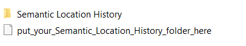
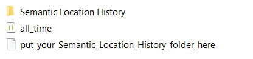

# activity_tragle
Google is tracking everything, we just look at it [here](https://takeout.google.com/).

You need to download (at least) your **Location History** in ```.json```


Put your folder ```Semantic Location History``` into the ```data``` folder at root.



After running ```main.py``` you should have a file called ```all_time.json```.
